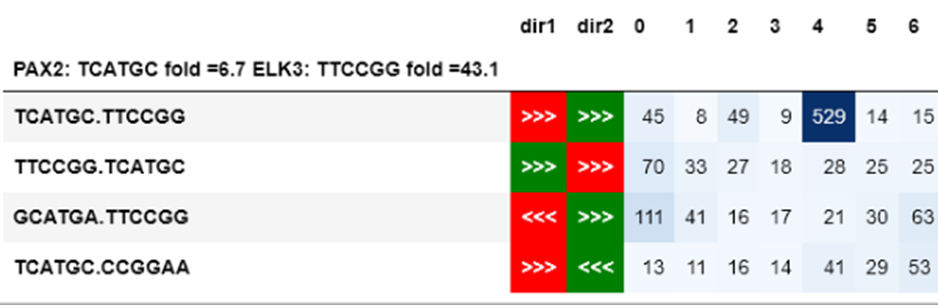
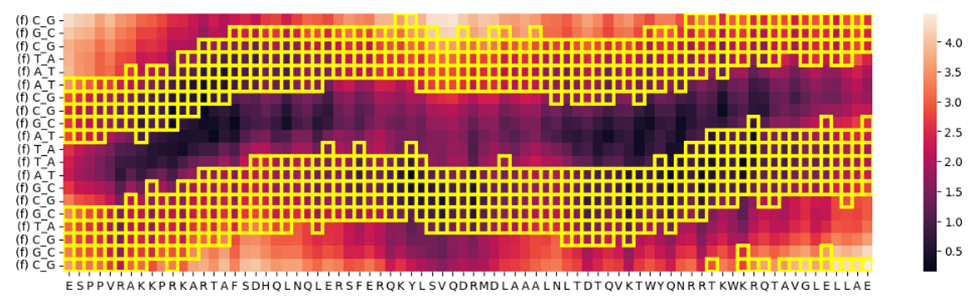

# Evaluating the Capability of RoseTTAFold2NA to Predict the Spacing and Orientation of Protein-DNA Interactions

## INTRODUCTION
### About this project

Selex is a powerful tool for investigating protein-DNA interactions. Experimental results can help us to find models of transcription factors and understand the spacing and orientation preferences of proteins on DNA.

RoseTTAFold2NA is an AI tool that can predict protein-DNA structures with high accuracy. It can accurately predict the structure of a protein-DNA complex.

The goal of this project is to determine whether information stored in training data allows AI models to accurately predict orientational and spatial preferences of protein-DNA complexes. For this purpose, we used 120 PWM models from CAP-SELEX experiments that showed the spacing and/or orientation preferences of two transcription factors. We then used RoseTTAFold to predict their structures using different DNA sequences as input, resulting in 1620 PDB files for analysis.The results suggest that the training data for AI models could be enriched with experimental data from SELEX to improve their prediction abilities.

### What is the spacing and orientation preferences? And how can SELEX tell us about this?

For example, we have SELEX data for a mixture of two transcription factors: PAX2 and ELK3. From the individual SELEX data, we know that the most enriched kmer for PAX2 is **TCATGC** (kmer1) and that for ELK3 it is **TTCCGG** (kmer2). We can then refer to their mixed SELEX data to count **TCATGC[0N]TTCCGG**, **TCATGC[1N]TTCCGG**,...,**TCATGC[XN]TTCCGG**, where XN - is X random nucleotides between kmers. This information tells us about the spacing preferences of these two TFs. But what if one TF prefers the reverse complement strand? And what if it prefers kmer from ELK first and then PAX? For this purpose, we also need to consider different orientations. Together, there could be four different orientations in which the two TFs could organize. Let's call the first orientation_1 (naming is subjective), and we can get orientation_2 by simply swapping their positions. This would be **TTCCG[XN]TCATGC**, orientation_3 could be constructed from the reverse complement of kmer1, and orientation_4 from kmer2. If we count the hits for such sequences, we could take a table as shown in the picture below. 

**Fig.1.** Part of the table with analysis of SELEX mixtures for PAX2 and ELK3 transcription factors

As we can see from the table, these two proteins have an orientation preference - orientation_1 and 4 nucleotides between them. That's a very simple example to illustrate. The more complex method of analysis can be found in the paper dedicated to this project.

### How can we use RoseTTAFold2NA for prediction of such preferences?
Once we have established from experimental SELEX data, two kmers and their spacing/orientation preferences, we can create an input for RoseTTAFold2NA with a long DNA sequence, which will consist of two parts: one that is preferred from SELEX, and a competitive one. Then, we run the program and analyze which part of the DNA the two proteins were inserted into. For example, if our preferred DNA from the SELEX experiment is **TCATGC[4N]TTCCGG**, we could create several competitive sequences:


| Name of competitive sequence | Sequence            |
|------------------------------|---------------------|
| orientation_2                | TTCCGG[4N]TCATGC    |
| orientation_3                | GCATGA[4N]TTCCGG    |
| orientation_4                | TCATGC[4N]CCGGAA    |
| spacing_plus1                | TCATGC[5N]TTCCGG    |
| spacing_plus2                | TCATGC[6N]TTCCGG    |
| spacing_minus1               | TCATGC[3N]TTCCGG    |
| spacing_minus2               | TCATGC[2N]TTCCGG    |

**Table1.** Seven competitive DNA sequences for the one with spacing and orientation preferences from the SELEX experiment.
     
Then, if we want for example to test which spacing/orientation would be preferred by RoseTTAFold2NA, we can construct DNA for input as shown in the table below. To eliminate the hypothetical bias in the program relative to the start/end of the DNA input, the reverse case was tested as well.

| DNA Input Sequence                        | Description                    | Reverse Case |
|-------------------------------------------|--------------------------------|--------------|
| TCATGC[4N]TTCCGG –dist-- TCATGC[6N]TTCCGG | spacing 4 or spacing 6         | No           |
| TCATGC[6N]TTCCGG –dist-- TCATGC[4N]TTCCGG | spacing 6 or spacing 4         | Yes          |
| TCATGC[4N]TTCCGG –dist-- GCATGA[4N]TTCCGG | orientation_1 or orientation_3 | No           |
| GCATGA[4N]TTCCGG –dist-- TCATGC[4N]TTCCGG | orientation_3 or orientation_1 | Yes          |
| ...                                       | ...                            | ...          |

**Table2.** Table with different DNA sequences for RoseTTAFold2NA input. Each sequence contains one preferred by the SELEX experiment as well as a competitive one, and the distance between them.

For each Position Weight Matrix (PWM) model obtained from the SELEX experiment, it was constructed from 5 to 7 competitive DNA sequences. The model gives 7 sequences if TFs spacing preference is bigger then 2 (so it allows a subtraction of 1 and 2), and always includes 5 sequences as three competitive orientations and  addition of 1 and 2 to spacing preferences are always possible. Subsequently, the output files were analyzed.

## The analysis of output PDB files

The output PDB files (in our case) contain four chains: two for the two transcription factors and two strands of DNA. Using the MDTraj library, the contacts can be calculated between each nucleic acid in chain 3 and each amino acid in chains 1 and 2. This is the same for chain 4. Then, an array can be constructed as shown in the figure below, which represents the minimum distance between nucleic acids in chain 3 and their corresponding reverse-complement nucleic acids on chain 4, if the minimum distance is from a reverse complementary strand, it will be marked with a yellow square.
 


**Fig.2.** Heatmap of distances calculated by the mdtraj library for the BARHL protein and the CGCTAACCGATTAGCGTGC DNA sequence used as input for RoseTTAFold2NA. The example case of one protein is shown for clarity in the axis labels. Distances on the heat map are in nm.

The simple threshold could be applied for analysis of protein-DNA contancts. For example, if we apply threshold of 0.4nm we could see picture like this


**Fig.3.**  Heatmap of distances calculated by the mdtraj library for the BARHL protein and the CGCTAACCGATTAGCGTGC DNA sequence with a threshold of 0.4 nm

Then, we can only consider nucleic acids that contain at least one value below a certain threshold for any amino acid. The nucleic acids in the input sequence CGCTAACCGATTAGCGTCGC which are above the threshold are replaced by the symbol "\_". The sequence with these nucleic acids and "\_" can be considered a k-mer generated from a PDB file.

## The prediction score

The prediction of spacing and orientation preferences by RoseTTAFold2NA is considered TRUE if there are more "_" symbols in the region with a competitive DNA sequence than in the preferred sequence from the SELEX experiment. The results were also compared with randomly generated k-mers from the DNA input.

## RESULTS

The results are presented in the bar charts and table of a Chi Square analysis of scores from RoseTTAFold2NA output PDB files and a random generation of k-mers.


**Fig.4.** Bar charts with distribution of scores for random and Rosetta's k-mers

| Orientation/Spacing  | Chi Square Test p-values                |
|----------------------|----------------------|
| orient_1_2           | 0.09   |
| orient_1_3           | 0.45   |
| orient_1_4           | 0.52   |
| orient_2_1           | 0.67   |
| orient_3_1           | 0.32   |
| orient_4_1           | 0.27   |
| spac_m1              | 0.30   |
| spac_m1_r            | 0.87   |
| spac_m2              | 0.25   |
| spac_m2_r            | 1.00   |
| spac_p1              | 1.00   |
| spac_p1_r            | 0.78   |
| spac_p2              | 0.58   |
| spac_p2_r            | 0.16   |

**Table.3.** Table with Chi-Square Test p-values for comparison of spacing / orientation preferences prediction by RoseTTa Fold 2 NA and random k-mer generation.

The Chi Square test haven’t indicated any statistically significant (p-value <= 0.05) difference for any way of constructing DNA competitive sequence

## Conclusion 
The observed data suggest that SELEX data could be used to enrich training data for AI structural models and greatly improve their prediction of proteins and DNA interaction

## SETUP
### Environment
For repeating this calculation set up the environment, please use the provided environment.yml file. Please, replace 'NAME' and 'YOUR_PREFIX' with your specific information.
### Usage
Activate your conda environment. Navigate to the lib directory. Execute the 'main.py' script with conditions suitable for your data. Refer to the following script help guide:
```
usage: main.py [-h] [--ncores NCORES] [--seed SEED] [--threshold THRESHOLD]
               [--scheme {ca,closest,closest-heavy,sidechain,sidechain-heavy}]

Parser generating kmers from pdb files of RoseTTAFold2NA

options:
  -h, --help            show this help message and exit
  --ncores NCORES       The number of cores used for exctracting kmers from
                        pdb files
  --seed SEED           Seed for generating random kmers
  --threshold THRESHOLD
                        Threshold for distance between nucleic acid and amino
                        acids for counting contact
  --scheme {ca,closest,closest-heavy,sidechain,sidechain-heavy}
                        Type of counting distance between nucleic acid and
                        amino acid. Allowed values: 'ca', 'closest', 'closest-
                        heavy', 'sidechain', 'sidechain-heavy'. For more
                        information, visit: https://mdtraj.org/1.9.4/api/gener
                        ated/mdtraj.compute_contacts.html
```
To repeat the calculations used in this study, you can use the following command:
```
python main.py --ncores 25 --seed 42 --threshold 0.45 --scheme closest-heavy
```
### Data
PDB files for analysis will be uploaded later or can be obtained from [RoseTTAFold2NA v0.2](https://github.com/uw-ipd/RoseTTAFold2NA) using these [sequences]('data/df_input.csv') as input. Note that D: should be used with a DNA sequence file as an indicator of double-stranded DNA.
