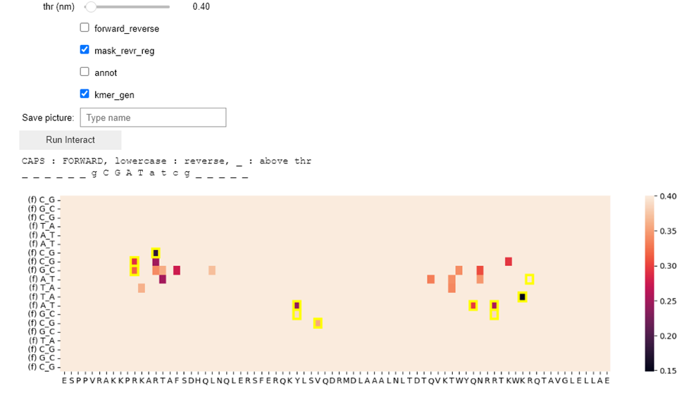

# Evaluating the capability of RoseTTAFold2NA and AlphaFold 3 to predict the spacing and orientation of TF-TF-DNA Interactions

This repository contains a sample dataset suitable for testing the pipeline in the file [data/sample.tar.gz](data/sample.tar.gz) </br>
The whole dataset is available by the [link](https://doi.org/10.5281/zenodo.14844637)</br>
The versions of libraries and software used are listed in the environment [file]('environment.yml')</br>

## INTRODUCTION
### About this project

SELEX is a powerful tool for investigating protein-DNA interactions. Experimental results can help us to find models of transcription factors and understand the spacing and orientation preferences of proteins on DNA.

RoseTTAFold2NA and AlphaFold 3 are AI tools that can predict protein-DNA structures with high accuracy. They can accurately predict the structure of a protein-DNA complex.

The goal of this project is to determine whether the information stored in training data allows AI models to accurately predict orientation and spacing preferences of protein-DNA complexes. For this purpose, we used 119 PWM models from CAP-SELEX experiments that showed the spacing and/or orientation preferences of two transcription factors. We then used RoseTTAFold2NA and AlphaFold 3 to predict their structures using different DNA sequences as input, resulting in 1620 PDB files for analysis. The results suggest that the training data for AI models could be enriched with experimental data from SELEX to improve their prediction abilities.

### What are the spacing and orientation preferences? And how can SELEX tell us about this?

For example, we have SELEX data for a mixture of two transcription factors: PAX2 and ELK3. From the individual SELEX data, we know that the most enriched kmer for PAX2 is **TCATGC** (kmer1) and that for ELK3 it is **TTCCGG** (kmer2). We can then refer to their mixed SELEX data to count **TCATGC[0N]TTCCGG**, **TCATGC[1N]TTCCGG**,...,**TCATGC[XN]TTCCGG**, where [XN] denotes X random nucleotides inserted between the k-mers. This information tells us about the spacing preferences of these two TFs. But what if one TF prefers the reverse complement strand? And what if it prefers kmer from ELK first and then PAX? For this purpose, we also need to consider different orientations. Together, there could be four different orientations in which the two TFs could organize. Let's call the first orientation_1 (naming is subjective), and we can get orientation_2 by simply swapping their positions. This would be **TTCCG[XN]TCATGC**, orientation_3 could be constructed from the reverse complement of kmer1, and orientation_4 from kmer2. If we count the hits for such sequences, we could take a table as shown in the picture below. 

**Fig.1.** Part of the table with analysis of SELEX mixtures for PAX2 and ELK3 transcription factors

As we can see from the table, these two proteins exhibit a preference for orientation_1, with a spacing of 4 nucleotides between them. That's a very simple example to illustrate. The more complex method of analysis can be found in the paper dedicated to this project.

### How can we use RoseTTAFold2NA and AlphaFold 3 for prediction of such preferences?
Once we have determined from experimental SELEX data the two k-mers and their spacing/orientation preferences, we can create an input for programs with a long DNA sequence, which will consist of two parts: one that is SELEX-preferred and one competitive. Then, we run the program and analyse which part of the DNA the two proteins were inserted into. For example, if our preferred DNA from the SELEX experiment is **TCATGC[4N]TTCCGG**, we could create several competitive sequences:

| Name of competitive sequence | Sequence            |
|------------------------------|---------------------|
| orientation_2                | TTCCGG[4N]TCATGC    |
| orientation_3                | GCATGA[4N]TTCCGG    |
| orientation_4                | TCATGC[4N]CCGGAA    |
| spacing_plus1                | TCATGC[5N]TTCCGG    |
| spacing_plus2                | TCATGC[6N]TTCCGG    |
| spacing_minus1               | TCATGC[3N]TTCCGG    |
| spacing_minus2               | TCATGC[2N]TTCCGG    |

**Table1.** Seven competitive DNA sequences corresponding to the spacing and orientation preferences observed in the SELEX experiment.
     
Then, if we want to test which spacing/orientation would be preferred by RoseTTAFold2NA or AlphaFold 3, we can construct DNA for input as shown in the table below. To eliminate the hypothetical bias in the program relative to the start/end of the DNA input, the reverse case was tested as well.

| DNA Input Sequence                        | Description                    | Reverse Case |
|-------------------------------------------|--------------------------------|--------------|
| TCATGC[4N]TTCCGG 窶電ist-- TCATGC[6N]TTCCGG | spacing 4 or spacing 6         | No           |
| TCATGC[6N]TTCCGG 窶電ist-- TCATGC[4N]TTCCGG | spacing 6 or spacing 4         | Yes          |
| TCATGC[4N]TTCCGG 窶電ist-- GCATGA[4N]TTCCGG | orientation_1 or orientation_3 | No           |
| GCATGA[4N]TTCCGG 窶電ist-- TCATGC[4N]TTCCGG | orientation_3 or orientation_1 | Yes          |
| ...                                       | ...                            | ...          |

**Table2.** DNA sequences for RoseTTAFold2NA/AlphaFold 3 input. Each sequence contains both a SELEX-preferred sequence and a competitive sequence, along with the distance between them.

For each Position Weight Matrix (PWM) model obtained from the SELEX experiment, it was constructed from 5 to 7 competitive DNA sequences. The model gives 7 sequences if TFs spacing preference is bigger than 2 (so it allows a subtraction of 1 and 2), and always includes 5 sequences as three competitive orientations and  addition of 1 and 2 to spacing preferences are always possible. Subsequently, the output files were analysed.

## The analysis of output PDB files

The output PDB files (in our case) contain four chains: two for the two transcription factors and two strands of DNA. Using the MDTraj library, the contacts can be calculated between each nucleic acid in chain 3 and each amino acid in chains 1 and 2. This is the same for chain 4. Then, an array is constructed as shown in the figure below, representing the minimum distance between nucleic acids in chain 3 and their corresponding reverse-complement nucleic acids on chain 4. If the minimum distance comes from a reverse-complementary strand, it is marked with a yellow square.
 


**Fig.2.** Heatmap of distances calculated by the MDTraj library for the BARHL protein and the CGCTAACCGATTAGCGTGC DNA sequence used as input for RoseTTAFold2NA. The example case of one protein is shown for clarity in the axis labels. Distances on the heat map are in nm.

A simple threshold can be applied for the analysis of protein-DNA contacts. For example, if we apply a threshold of 0.4 nm, we obtain the following figure:



**Fig.3.**  Heatmap of distances calculated by the MDTraj library for the BARHL protein and the CGCTAACCGATTAGCGTGC DNA sequence with a threshold of 0.4 nm

Then, we can only consider nucleic acids that contain at least one value below a certain threshold for any amino acid. The nucleic acids In the input sequence CGCTAACCGATTAGCGTCGC, nucleic acids that do not meet the threshold are replaced by the symbol "\_". The resulting sequence, containing both nucleotides and "\_" symbols, can be considered a k-mer generated from a PDB file.

## The prediction score

The prediction of spacing and orientation preferences by RoseTTAFold2NA or AlphaFold 3 is considered successful if the region corresponding to the competitive DNA sequence contains more "\_" symbols than the region corresponding to the SELEX-preferred sequence.

## RESULTS

The results are presented in the bar charts showing the fraction of correct predictions. The bar charts are shown for separate mode of competitive DNA sequence creation


**Fig.4.** Bar charts showing the fraction of correct predictions. P-values were obtained from a binomial test with a probability of success equal to 0.5. One asterisk (\*) indicates a p-value less than 0.05, and two asterisks (\*\*) indicate a p-value less than 0.01. The exact p-values are listed in Table 3.

To create a summary, the same values were calculated for all modes combined. The results are shown in Figure 5. Additionally, the two programs were tested on the standard task of predicting TF-TF-DNA structure without competitive DNA. For this purpose, seven structures that were experimentally solved in the dedicated paper were predicted by RoseTTAFold2NA and AlphaFold 3, and the results were compared with experimental data. It was found that both programs were able to predict the overall geometry of the complexes in almost all cases (6 out of 7 for RoseTTAFold2NA and 7 out of 7 for AlphaFold 3). This suggests that the limitations of these programs in predicting spacing and orientation preferences lie not in their architecture or training process, but in the experimental training data, and that experimental SELEX data might be very useful for expanding their capabilities.


**Fig.5.** Bar charts showing the fraction of correct predictions. P-values were obtained from a binomial test with a probability of success equal to 0.5. One asterisk (\*) indicates a p-value less than 0.05, two asterisks (\*\*) indicate a p-value less than 0.01, and three asterisks (\*\*\*) indicate a p-value less than 0.001. The exact p-values are listed in Table 3.

| mode       | RoseTTAFold2NA           | AlphaFold 3           | Side of the preferred DNA |
|------------|--------------------------|-----------------------|---------------------------|
| orient_1_2 | 1.9611841673751263e-05   | 0.06629133125279607   | left                      |
| orient_1_3 | 0.0008881371170898862    | 0.005726861906884234  | left                      |
| orient_1_4 | 0.0017105290774106707     | 0.0985236274022573    | left                      |
| spac_m1    | 0.00044531067691715805    | 0.27124833775940455   | left                      |
| spac_m2    | 0.001424496094649118      | 0.08219306855694346   | left                      |
| spac_p1    | 0.005726861906884234      | 0.7140263124847865    | left                      |
| spac_p2    | 4.693404946065789e-07     | 0.0985236274022573    | left                      |
| orient_1_2 | 0.016786329118478174      | 0.35935826390511194   | right                     |
| orient_1_3 | 3.2837572373979797e-06    | 0.5824937911572262    | right                     |
| orient_1_4 | 0.016786329118478174      | 0.8546300421797669    | right                     |
| spac_m1    | 3.2837572373979797e-06    | 0.0017105290774106707  | right                     |
| spac_m2    | 9.43985778811796e-08     | 0.18428587288036513   | right                     |
| spac_p1    | 0.06629133125279607       | 0.27124833775940455   | right                     |
| spac_p2    | 0.04326826257460883       | 0.00044531067691715805 | right                     |
|summary | 1.698449597165341e-22 | 0.0022170421130118588 | left |
|summary | 6.032331555111355e-19 | 0.005474543979658679 | right | 

**Table.3.** P-values from Figures 4 and 5. The p-values for overall geometry are not listed, as n = 7 is not sufficient for statistical tests.
## Conclusion 
The observed data suggest that SELEX data could be used to enrich training data for AI structural models and greatly improve their prediction of proteins and DNA interaction.

## SETUP
### Data
For running calculations on the sample dataset, navigate to the data directory and uncompress the sample.tar.gz file:
```
cd data
tar -xzvf sample.tar.gz
```
This will create a data/sample folder containing two subdirectories and the df_input.csv file </br>
</br>
For running calculations on the full dataset, please download it by the [link](https://doi.org/10.5281/zenodo.14844637), copy the full_dataset.tar.gz file into the data folder, , navigate to the data directory and uncompress the full_dataset.tar.gz file:
```
cd data
tar -xzvf full_dataset.tar.gz
```
This will create two folders: </br>
data/alphafold3<br>
data/commit_6a1b3d_pdbs<br>
### Environment
For repeating this calculation set up the environment, please use the provided environment.yml file. Please, replace 'YOUR_NAME' and 'YOUR_PATH' with your specific information.
### Usage
The environment could be installed using environment.yml file and next command:
```
conda env create -f environment.yml
```
Activate your conda environment. Navigate to the lib directory. 
```
conda activate <environment_name>
cd lib
```
Execute the 'main.py' script with conditions suitable for your data. Refer to the following script help guide:
```
usage: main.py [-h] [--ncores NCORES] [--threshold THRESHOLD] [--scheme {ca,closest,closest-heavy,sidechain,sidechain-heavy}] [--dataset {sample,full}]

Parser generating kmers from pdb files of RoseTTAFold2NA

options:
  -h, --help            show this help message and exit
  --ncores NCORES       The number of cores used for extracting kmers from pdb files
  --threshold THRESHOLD
                        Threshold for distance between nucleic acid and amino acids for counting contact
  --scheme {ca,closest,closest-heavy,sidechain,sidechain-heavy}
                        Type of counting distance between nucleic acid and amino acid. Allowed values: 'ca', 'closest', 'closest-heavy', 'sidechain', 'sidechain-heavy'. For more information, visit: https://mdtraj.org/1.9.4/api/generated/mdtraj.compute_contacts.html
  --dataset {sample,full}
                        Sample or full dataset
```
To repeat the calculations used in this study, you can use the following command:
```
python main.py --ncores 25 --threshold 0.45 --scheme closest-heavy --dataset full
```

### Example of script run
The screenshot of working script output could be found [here](pics/Capture.png) and is shown below:


The paper was initially submitted before the release of AlphaFold 3; therefore, the repository is named using only RoseTTAFold2NA and name is left to avoid confusion with the links
